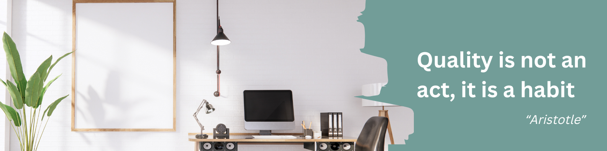

# 👋 Hi There

My name is Amir Dehbashi and I'm a Master's student in Computer Software Engineering at Shahab Danesh University residing in Iran.

I was fortunate to get known to a professional IT company during my university studies and be able to work with their experienced members as an apprentice to develop great ideas and projects. During this time I interacted with different IT fields like web development, mobile app development, UI design, group interaction, and team working. After quite some time I managed to secure a role as an Android Developer and work with them for nearly 5 years and participate in some eCommerce, educational, and medical projects.

I enjoy spending my time exploring various technical aspects and practicing different IT stuffs because there is a lot to learn in the IT industry and being able to consume the right resources is very important.

For now, I am currently working as a freelance software tester with junior experience in manual & automation testing.

-----------------------------------------------------------------------------------------------------------------------------------------------------------------------------------

### 💻 Skills & Tools

<!------>
<!------>
<!------>
<!------>
<!------>

-----------------------------------------------------------------------------------------------------------------------------------------------------------------------------------

### 📌 Products

(Will Be Available Soon)

-----------------------------------------------------------------------------------------------------------------------------------------------------------------------------------

### 📋 University Degress

Education | Field | Orientation
------------ | ------------- | -------------
Master | Computer Engineering | Software Development
Bachelor | Electrical Engineering | Power Systems

-----------------------------------------------------------------------------------------------------------------------------------------------------------------------------------

### 🌐 Language Speaking

* English  
* Persian  
* Arabic

-----------------------------------------------------------------------------------------------------------------------------------------------------------------------------------

### 📫 Contact Me

  

<!--- -------------------------------------------------------------------------------------------------------------------------------------------------------------------------------- --->

<!--- ### 📈 Stats --->

<!---  --->
<!---  --->
